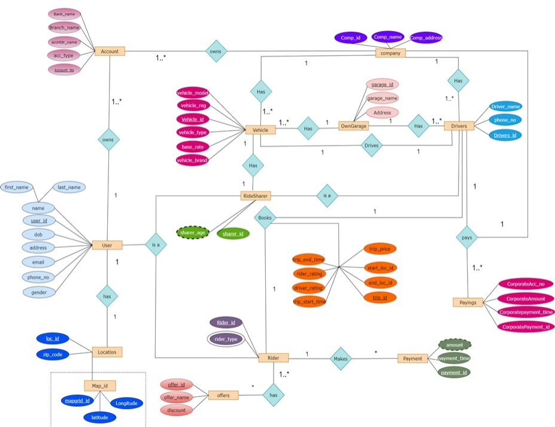
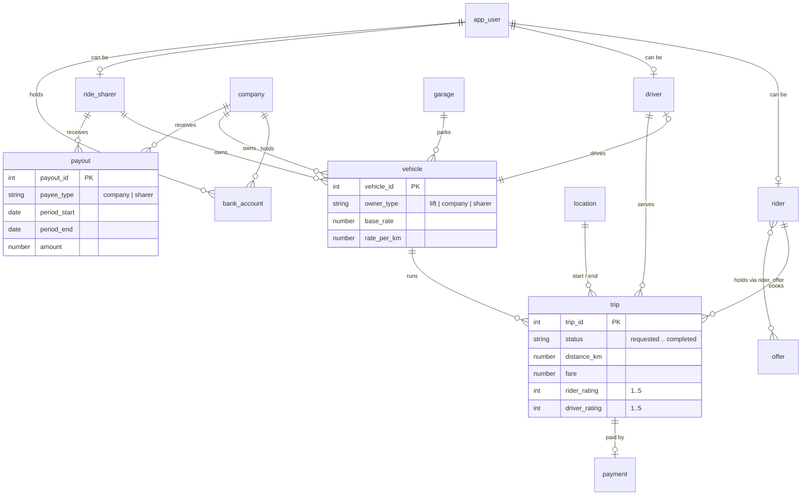
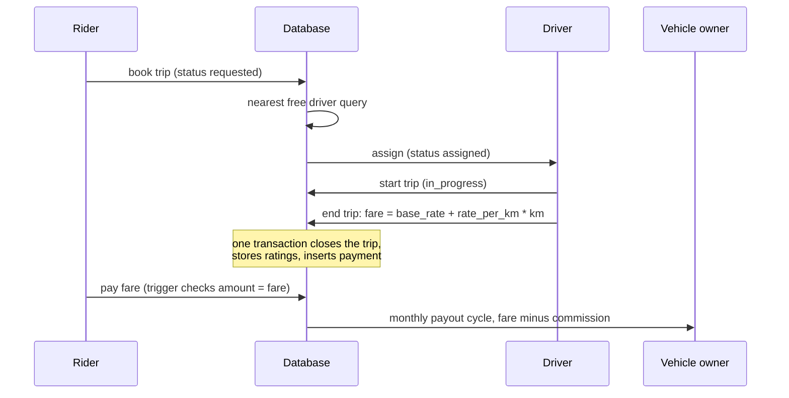

# LIFT

A relational database for a ride-sharing company with a mixed fleet: LIFT owns some vehicles, hires others from sub-companies, and takes personal cars from individual ride sharers. Riders pay per trip, but vehicle owners are settled in batched payout cycles where LIFT keeps a commission. The schema models the whole loop: booking, driver assignment, trip lifecycle, payment, and settlement.

Everything runs and is tested against SQLite, no server or install needed. Types are kept Oracle friendly since that is where the project started.

## Data model

The original ER diagram, drawn in Chen notation when this database was first designed:



The implemented schema follows it, with a few consolidations made along the way (one vehicle table instead of three, the map grid folded into location):



The three vehicle ownership paths live in one `vehicle` table with an `owner_type` discriminator and CHECK constraints, not three parallel tables. Same pattern for `bank_account` and `payout`. Reasoning in [docs/design-decisions.md](docs/design-decisions.md).

## A trip, end to end



## Run it

```bash
python tests/build_db.py lift.db     # build a seeded database
python tests/test_lift_db.py         # run the test suite (11 tests)
sqlite3 lift.db < queries/analytics.sql   # optional, needs sqlite3 CLI
```

The tests cover the fare calculation, the trip completion transaction, nearest-free-driver assignment, and the constraints (ratings 1 to 5, positive fares, single owner per vehicle, payment must match fare).

## Layout

| Path | What |
|---|---|
| `schema/01_tables.sql` | Tables with FK and CHECK constraints |
| `schema/02_constraints.sql` | Uniqueness rules and integrity triggers |
| `schema/03_indexes.sql` | FK and access-path indexes |
| `schema/04_seed.sql` | Deterministic sample data (fares follow the pricing rule) |
| `schema/05_views.sql` | Earnings split and payout-due views |
| `queries/analytics.sql` | 10 operational queries: payouts per cycle, driver utilization, peak hours, zones, rider LTV, driver quality |
| `queries/complete_trip.sql` | Trip completion as one atomic transaction |
| `tests/` | Build script and test suite (stdlib only) |
| `docs/` | [requirements](docs/requirements.md), [schema reference](docs/schema.md), [design decisions](docs/design-decisions.md), [scaling notes](docs/scaling.md) |
| `lift.sql` | The original DDL from December 2022, kept exactly as we wrote it back then |
| `Scenario.docx` | The original scenario document from 2022 ([docs/requirements.md](docs/requirements.md) is its markdown conversion) |

## What this models well, and what it does not

Models well: fleet ownership variants, the trip lifecycle with status-dependent constraints, money in (per-trip payments) vs money out (batched commissions), and enough integrity rules that bad states are unrepresentable rather than merely discouraged.

Does not model: real geospatial search, surge pricing, driver shifts, or refunds. The first of those is discussed honestly in [docs/scaling.md](docs/scaling.md).
